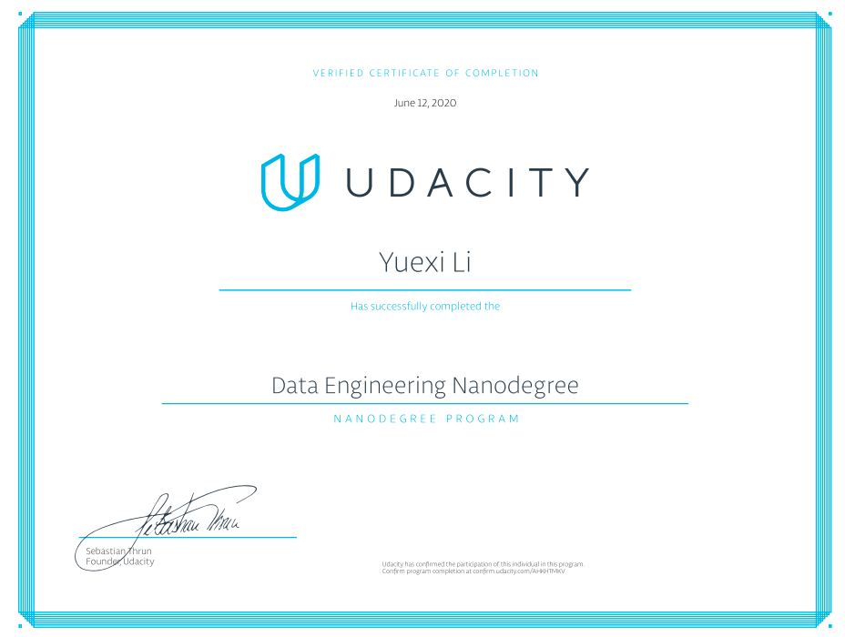

# Data-Engineering

This repository contains 6 passed projects of the [Data Engineering Program](https://www.udacity.com/course/data-engineer-nanodegree--nd027). 

<table> 
<tbody> 
<tr>
        <th>Lesson</th>
        <th>Project Overview</th>

</tr>

<tr>
        <td><b>Data Modeling</td>
        <td> Model user activity data for a music streaming app called Sparkify and optimize queries for understanding what songs users are listening to.  
            <b><a href="https://github.com/Yuexi-Li/Data-Engineering/tree/master/DataModeling-Postgres">Project 1: Relational Model with Postgres</a>  </b>  
            
 -  Desgin the schema and define Fact and Dimension tables;   
                                            -  Insert Data into the tables.
 
            <b><a href="https://github.com/Yuexi-Li/Data-Engineering/tree/master/DataModeling-ApacheCassandra">Project 2: NoSQL data model with Apache Cassandra</a> </b> 
            
 -  Model the data to help the data team answer queries about the app usage;    
            - Set up Apache Cassandra database tables in ways to optimize writes of transactional data on user sessions. 

            </td>
</tr>

<tr>
        <td><b>Cloud Data Warehouse</td>
        <td><b><a href="https://github.com/Yuexi-Li/Data-Engineering/tree/master/DataWarehouse-AmazonRedshift">Project 3: Data Warehouse(AWS)</a>  </b>  
        
 - Build an ELT pipeline that extracts Sparkify’s data from S3, Amazon’s popular storage system; 
         - Stage the data in Amazon Redshift and transform it into a set of fact and dimensional tables for the Sparkify analytics team to continue finding insights in what songs their users are listening to.</td>
  
</tr>

<tr>
        <td><b>Data Lakes with Spark</td>
         <td><b><a href="https://github.com/Yuexi-Li/Data-Engineering/tree/master/DataLake-Spark">Project 4: Data Lake with Apache Spark</a>  </b>  
        
 - Build an ETL pipeline for a data lake <em>(The data resides in S3, in a directory of JSON logs on user activity on the app, as well as a directory with JSON metadata on the songs in the app);</em>  
      - Load data from S3, process the data into analytics tables using Spark, and load them back into S3;  - Deploy this Spark process on a cluster using AWS. 

        
</tr>

<tr>
        <td><b>Data Pipelines with Airflow</td>
         <td>Use up-and-coming tool Apache Airflow, developed and open-sourced by Airbnb and the Apache Foundation to continue to work on Sparkify’s data infrastructure. 
         <b><a href="https://github.com/Yuexi-Li/Data-Engineering/tree/master/DataPipelines-Airflow">Project 5: Data Pipeline with Airflow</a>  </b>  
         
 - Creatand automate a set of data pipelines;  
         - Configure and schedule data pipelines with Airflow, setting dependencies, triggers, and quality checks as would in a production setting.
</tr>

<tr>
        <td><b>Capstone</td>
         <td><b><a href="https://github.com/Yuexi-Li/Data-Engineering/tree/master/CapstoneProject">Capstone Project</a>  </b>  
        
 - Define the scope of the project and the data will be working with;  
        - Gather data from four different sourcces then transform, combine, and summarize it;  
        - Create a clean database for others to analyze.
</tr>
</tr>
</tbody>
</table>
                

